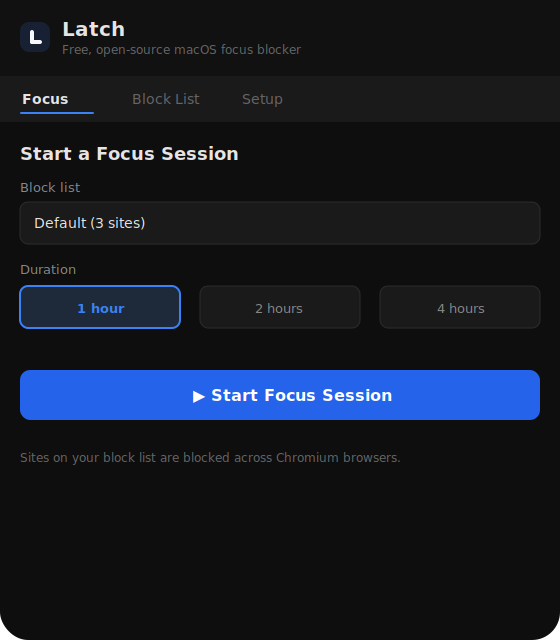
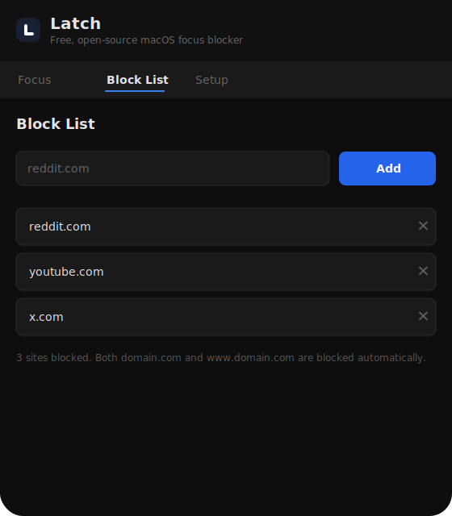
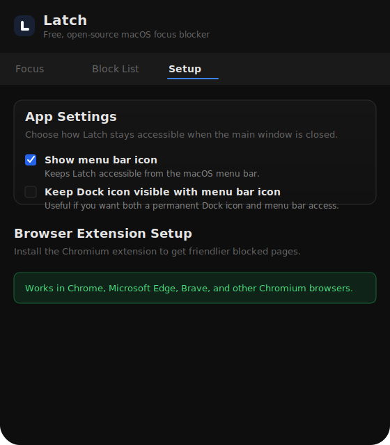

# Latch

Latch is a local-first macOS focus blocker built with Electron.

It blocks distracting sites with a privileged helper, keeps blocklists on-device, and optionally uses a Chromium extension for a friendlier blocked-page experience.

## Download

Download the latest macOS build from the [GitHub Releases](../../releases) page.

For the friendlier blocked-page experience, also download the `Latch-chrome-extension.zip` asset from the same release.

## Chromium extension

To load the extension in Chrome, Edge, or another Chromium browser:

1. download `Latch-chrome-extension.zip` from [GitHub Releases](../../releases)
2. unzip it
3. open `chrome://extensions`
4. enable **Developer mode**
5. click **Load unpacked**
6. select the extracted `chrome` folder

If you already installed the desktop app, the packaged app bundle also includes the extension under `extensions/chrome`.

## Screenshots


*Focus session setup*


*Block list management*


*Settings and extension setup*

## Highlights

- macOS-only
- local-first, no accounts, no cloud sync
- timed sessions and always-on blocking
- local domain blocklists
- one-time privileged helper install
- Chromium extension bridge for blocked pages
- crash recovery for interrupted sessions
- menu bar support

## Requirements

- macOS 12+
- Node.js 20+
- pnpm 9+
- Xcode command line tools / Swift toolchain for packaging

## Development

```bash
pnpm install
pnpm typecheck
pnpm test
pnpm build:mac
```

Useful commands:

```bash
pnpm dev
pnpm lint
pnpm build:mac
```

## Packaging notes

`pnpm build:mac` prepares and packages:

- the Electron desktop app
- the macOS helper
- the Chromium extension bundle
- the native messaging host

On first launch, Latch prompts once to install the helper. The app bundle includes the unpacked Chromium extension under `extensions/chrome`.

## Manual smoke checklist

- install and launch the DMG build
- confirm the helper install prompt appears once
- confirm `/var/run/latch.sock` is reachable after setup
- load the Chromium extension from the app bundle
- start a session and verify `/etc/hosts` markers are written
- restart the app during an active session and verify recovery
- uninstall the helper from the app and verify cleanup

## Contributing

If you want to contribute:

1. install dependencies with `pnpm install`
2. run `pnpm typecheck && pnpm test && pnpm lint`
3. keep diffs small and macOS-focused
4. verify `pnpm build:mac` before proposing release-affecting changes

## Roadmap

- smoother first-run setup
- better packaged-app smoke coverage
- continued simplification of the macOS-only distribution flow

## License

MIT
